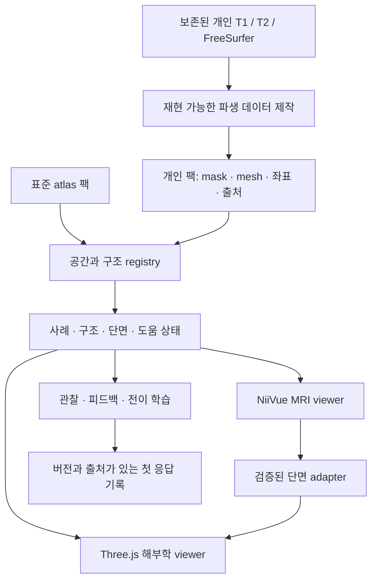
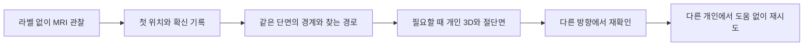

# MRI-Tutor: 개인 MRI와 3D 해부학 통합 도입 계획

_2026-09-09 · 한국 의사를 위한 MRI 해부학 학습 도구 · 단계별 구현 계획_

> 구현 업데이트: 기존 4명 × 18개 개인 GLB, native MRI texture plane, clipping·선택·복구·학습 도움 제어를 반영했다. P0 비교 실험과 P1/P2 핵심 검증은 [구현 기록](ATLAS-INTEGRATION-IMPLEMENTATION.md)에 있다. 평활화·Meshopt/LOD, 개인 피질과 P3 이후 교육/검수 단계는 남아 있다. 아래 설계 전체를 완료로 표시하지 않는다.

## 🎯 제품 목표와 이번 계획의 경계

**한 사람의 MRI에서 관찰한 구조를 그 사람의 3D 해부학과 연결하고, 도움 없이 다른 단면과 다른 사람에서도 다시 찾을 수 있게 한다.** Nervous System Atlas의 장면 통합·표면 제작·자료 연결 기술을 도입하되, MRI-Tutor가 이미 보유한 개인 영상과 학습 기록을 중심으로 발전시킨다.

이 계획은 [기술 조사 보고서](/Volumes/Aquatope/_DEV_/MRI-Tutor/docs/research/2026-09-09-nervous-system-atlas-analysis.md)와 [현재 파일 측정 결과](/Volumes/Aquatope/_DEV_/MRI-Tutor/docs/research/2026-09-09-atlas-audit-evidence.json)를 근거로 한다. 기존 작업 중 변경이 있는 상태를 확인했으며, 최초 계획 작성 시에는 이 계획서·조사 문서·증거 JSON만 추가했다. 그 계획 작성 단계에서는 원본 영상, 앱 코드, 이전 계획과 학습 기록을 수정하지 않았다.

기존 [trainer/PLAN.md](/Volumes/Aquatope/_DEV_/MRI-Tutor/trainer/PLAN.md)는 “3D는 공간 참고 모델이며 개인별 정밀 정합을 요구하지 않는다”고 정했다. 본 문서는 **다음 구현 단계에서 그 제한을, 같은 개인에서 유래한 데이터에 한해 해제하는 새 설계 제안**이다. 개인 영상 우선, 첫 응답 보존, 자동 분할과 전문가 정답의 구분, 별도 개인 전이 원칙은 유지한다. 구현 시작 시 두 계획의 우선관계를 명시하고 완료된 단계만 상태를 갱신한다.

### 가장 먼저 제공할 경험

학습자가 사례 01의 해마를 공부한다고 하자. 기본은 현재처럼 오른쪽 Axial MRI가 크게 보이고, 왼쪽에는 **사례 01의 분할에서 만든 해마·편도체·뇌실·시상 모델**이 나온다. MRI를 움직이면 왼쪽 모델 안의 실제 MRI 절단면도 같은 위치를 가리킨다. 절단 기능을 켜면 표면의 가려진 부분이 제거된다. 구조를 클릭하면 실제 mask 내부의 해당 지점 또는 적절한 단면으로 이동한다.

연습에서는 먼저 MRI에서 위치를 고른다. 첫 제출 후에만 필요에 따라 경계, 같은 단면의 3D, 짧은 찾는 경로를 공개한다. 이어 다른 단면, 다른 사람으로 넘어간다. 모델을 아름답게 만드는 목적은 이 탐색과 전이를 돕는 것이다.

### 초기 대상과 범위

| 단계 | 대상과 목적 | 우선 범위 |
|---|---|---|
| 첫 파일럿 | MRI-Tutor 기존 사용자 및 정신건강의학과 의사 | 변연계·기저핵·뇌실·주요 피질 랜드마크 |
| 공동 검수 | 신경영상 경험이 있는 영상의학과 전문의 + 신경과 또는 해부학 교육자 | 영상 경계, 명칭·좌우, 국소화 설명 |
| 다음 교육 팩 | 신경과·신경외과·영상의학과 전공의 | 주요 다발, 혈관 공급 영역, 뇌간의 교차와 국소화 |
| 후속 | 실제 병변·다중 시퀀스·척수 교육 | 자료 확보와 별도 검수 완료 후 |

처음부터 592개 모델과 125개 증후군을 이식하지 않는다. **개인 1명·핵심 10개 좌우 ROI → 기존 4명 → 피질 표면 → 교육 모듈** 순서로 검증 가능한 산출물을 만든다. 개인 4명은 제품 파일럿에 적합한 시작점이며, 한국 의사 전체의 학습 효과를 입증하는 표본은 아니다.

## 🧭 채택할 기술과 채택하지 않을 가정

| 결정 | 채택 이유와 조건 |
|---|---|
| 기존 NiiVue + Three.js 유지 | MRI 처리·학습 흐름을 보존하고 장면 기능을 점진적으로 추가한다. 현재 버전 호환성은 P0 실험으로 고정한다. |
| 같은 개인 label에서 먼저 mesh 생성 | 새 정합 없이 기존 검증된 좌표 경로를 활용할 수 있다. 자동 분할의 경계 한계는 그대로 남는다. |
| 같은 개인 FreeSurfer pial/white 후속 도입 | 개인 고랑·이랑을 보여주는 데 표준 표본의 affine 정합보다 목적에 맞다. 원천 표면 좌표 변환을 별도로 검증한다. |
| NIfTI 원본 강도 유지 | 개인 T1 int16, 정합 T2 float32를 기준 영상으로 유지한다. 미리 8-bit로 축소한 영상을 최종 MRI로 교체하지 않는다. |
| display mesh와 reference mask 분리 | smoothing·decimation의 변화가 정답과 label 조회에 들어가지 않게 한다. |
| GLB + Meshopt + LOD | 현재 단일 19.1 MB JSON을 구조/사례별로 나눠 필요한 모델부터 읽는다. 정확한 절감량은 측정 후 결정한다. |
| 명시적인 좌표·표현 계약 | 동일한 RAS라는 이유로 개인·MNI·Allen 공간을 섞지 않는다. |
| 핵심 구조 ID + 관계/출처 schema | MRI, 3D, 한국어 설명, 경로·문제를 같은 개념에 연결하되 atlas별 정의 차이는 보존한다. |

대안 비교는 P0에서 작은 장면으로 수행한다. NiiVue도 volume과 mesh를 함께 표시하는 공식 경로가 있으므로 단일 엔진이 성능·좌표·기능 검증에서 유리하면 선택할 수 있다.[^niivue] 다만 기존 두 viewer를 전면 교체하거나 Three.js로 NIfTI 처리 전체를 다시 만드는 작업은 초기 범위가 아니다.

사용하지 않을 가정은 다음과 같다: 표본 모델이 환자별 해부학과 같다, 고해상도 그리드가 새로운 조직 정보를 만든다, 자동 분할 내부 클릭이 임상 정답이다, 문헌 metadata 확인이 콘텐츠 의학 검수다. 이 구분은 전문 도구의 신뢰성과 학습 측정에 직접 필요하다.

## 🏗️ 데이터와 좌표 아키텍처

### 세 종류의 공간을 명시적으로 관리

| 공간 | 허용되는 직접 연결 | UI 이름 |
|---|---|---|
| `subject:<id>:T1-native-RAS-mm` | 그 개인의 T1, T1에 정합한 T2, 개인 label·표면 | “사례 01 · 개인 MRI와 연결” |
| `template:MNI152NLin2009cAsym:RAS-mm` | 정확히 해당 템플릿으로 제작·검수된 영상과 atlas | “표준 해부학” |
| `template:ICBM2009bSym:RAS-mm` | Allen 대응 영상·mask·surface | “Allen 참고 공간” |

같은 좌표 규약과 같은 해부 공간은 다른 개념이다. `spaceId`가 다르면 위치 cursor를 공유하지 않는다. 구조 이름/개념으로 비교하는 것은 가능하되 “개념 연결” 상태를 표시한다. 향후 개인↔표준 변환이 있으면 방향, 원천/대상 hash, 변환 파일, 검수 결과가 있는 명시적 edge만 허용한다. 단순 identity 또는 header 교체를 비선형 정합의 대체로 쓰지 않는다.



### Manifest v2의 최소 계약

아래는 전체 목표 schema다. 이번 구현은 개인 팩의 Space/Volume/Structure/Representation/Provenance와 SliceFrame을 우선 구현했고, 전문 검수·변환 edge의 확장 API는 후속이다. 데이터 검증기는 필수 값 누락과 호환되지 않는 공간을 거부한다.

| 레코드 | 필수 필드 | 필요한 이유 |
|---|---|---|
| `Space` | `id`, `unit`, `axisConvention`, `referenceImageHash` | mm/meter, RAS/LPS, 개인과 atlas 혼동 차단 |
| `Volume` | `id`, `spaceId`, `shape`, `voxelToWorld`, `dtype`, `slope`, `intercept`, `sourceHash`, `acquisitionSpacing` | 원래 강도, voxel 위치, 획득과 재표본화 이력 보존 |
| `Structure` | 안정적인 `id`, ko/en 명칭, 동의어, 좌우, 정의·버전 | 앱 label 번호와 해부학 개념을 분리 |
| `Representation` | `structureId`, `caseId`, `spaceId`, `kind`, `sourceLabelIds`, `referenceMask`, `mesh`, `lod`, `bounds`, `interiorAnchor` | 같은 구조의 개인 mask·표준 표면·도식 구분 |
| `Transform` | `fromSpace`, `toSpace`, `direction`, `files`, `hashes`, `method`, `parameters`, `qa` | 순서·역변환·재생성 조건 확인 |
| `Review` | 대상 hash, 검수자 역할, 날짜, 구조·시퀀스·단면 범위, 결과 | 검수가 바뀐 영상/다른 구조까지 자동 확장되지 않게 함 |
| `Provenance` | 원천 URL·버전·라이선스 전문·변경 내역·도구 버전 | 재현, 출처 표시, 배포 구성 |
| `SliceFrame` | `spaceId`, `originMm`, `uMm`, `vMm`, `normal`, pixel/voxel convention, revision | 실제 개인 MRI의 기울어진 단면을 3D에서도 재현 |

`Representation.kind`는 적어도 `subject-segmentation`, `subject-surface`, `template-parcellation`, `registered-specimen`, `schematic`, `functional-proxy`를 구분한다. `reviewStatus`와 `assessmentUse`를 별개로 둔다. 현재 개인 자동 label은 계속 `reference-only`다. 실제 전문가 정답을 만들 때에는 기존 자동 label의 flag를 바꾸지 않고 새 review/answer-set을 만들며 기존 기록의 의미를 보존한다.

`Structure`와 `Representation`은 일대다가 기본이다. AAL3 해마와 FreeSurfer 해마, dlPFC proxy와 실제 중전두이랑 구획을 ID 이름만으로 동일한 경계라고 취급하지 않는다. 겹치는 ROI는 source mask를 독립적으로 보존하고 picking 결과를 후보 배열로 반환한다. 활성 구조 우선순위는 UI 규칙이며 원본 label 덮어쓰기가 아니다.

### 개인 표면의 좌표 변환

1차 ROI mesh는 이미 보정된 `labels-reference.nii.gz`의 affine을 그대로 적용한다. 기존 코드의 scanner RAS↔배포 T1 header 대응을 mesh 제작에서 다시 중복 적용하지 않는다.

후속 FreeSurfer pial/white는 흔히 surface/tkregister RAS다. FreeSurfer 공식 관계를 이용해 다음 변환을 검증한다.[^fscoords]

```text
p_T1_world = H_rawavg_to_T1 · N_orig · inverse(T_orig) · p_surface

N_orig = 원천 orig.mgz의 voxel → scanner RAS
T_orig = 같은 orig.mgz의 voxel → tkregister RAS
H_rawavg_to_T1 = 현재 MRI-Tutor가 기록한 동일 촬영의 header 대응
```

이 식은 **orig와 rawavg가 같은 scanner RAS를 사용한다는 확인 이후** 적용한다. surface 파일에 저장된 geometry와 처리 단계가 다르면 원천 metadata에 따른 경로를 사용한다. 이미 scanner RAS로 변환한 surface에 이 식을 다시 적용하지 않는다. 기존 코드의 `rawavg_to_T1_RAS` 값만 pial 정점에 곧바로 곱하면 원점이 잘못될 수 있다.

RAS↔LPS에는 x/y 부호가 바뀌며, 기존 SimpleITK T2 transform은 resampling을 위한 fixed T1→moving T2 sampling 방향이다. 파일 이름만 보고 mesh에 forward transform처럼 적용하지 않는다. 각 변환은 합성 행렬뿐 아니라 이름 붙은 중간 공간과 검증점을 저장한다.

## 🧲 MRI 절단면과 3D renderer 통합

### 현재 코드에 넣을 경계

| 현재 파일 | 도입 시 책임 |
|---|---|
| [trainer/app.js](/Volumes/Aquatope/_DEV_/MRI-Tutor/trainer/app.js) | 3D geometry 제작·로딩을 새 scene module로 분리하고 개인/atlas 모드에 맞는 representation 사용 |
| [trainer/case-viewer.js](/Volumes/Aquatope/_DEV_/MRI-Tutor/trainer/case-viewer.js) | 현재 native slice frame, world 위치, window/level, 시퀀스를 명시적으로 제공 |
| [trainer/mri.js](/Volumes/Aquatope/_DEV_/MRI-Tutor/trainer/mri.js) | 표준 atlas도 같은 adapter 계약을 제공하되 template space 유지 |
| [trainer/cases.js](/Volumes/Aquatope/_DEV_/MRI-Tutor/trainer/cases.js) | 사례·선택·도움 상태를 연결하고 첫 응답 전 누출 차단 |
| [trainer/guided-practice.js](/Volumes/Aquatope/_DEV_/MRI-Tutor/trainer/guided-practice.js) | 기존 실제 단면·mask 내부 문제 구성 유지 |
| [trainer/case-state.js](/Volumes/Aquatope/_DEV_/MRI-Tutor/trainer/case-state.js) | 기록 migration 및 평가 용도 분리 |
| [trainer/split-view.js](/Volumes/Aquatope/_DEV_/MRI-Tutor/trainer/split-view.js) | 현재 40:60 기본 분할·접기·복원 유지, 숨겨진 renderer의 불필요한 작업 정지 |

새 파일은 역할별로 `trainer/viewer/space-registry.js`, `selection-store.js`, `subject-scene.js`, `mesh-loader.js`, `slice-adapter.js`, `slice-worker.js`를 제안한다. 처음부터 앱 전체를 TypeScript/React로 바꾸지 않는다. 필요하면 새 모듈의 JSDoc과 schema부터 적용한다.

### 단면 표시 전략

Nervous System Atlas는 전 volume을 `Data3DTexture`로 올려 shader에서 샘플링한다. 그 방식을 현재 1 mm MNI에 쓰기와 4,040만 복셀 개인 영상에 쓰기는 메모리 비용이 다르다. 개인 volume 하나의 int16 배열은 약 **80.8 MB**, float32는 약 **161.6 MB**이며 압축 해제 복사·GPU texture·NiiVue 내부 표현은 별도다. 두 WebGL context에서 texture 객체를 직접 공유할 수도 없다.

**P0 기본 후보는 필요한 단면만 만드는 worker → 2D texture 방식**이다. 현재 volume에서 slice frame을 받아 실제 단면만 계산하고, 그 이미지를 정확한 위치의 Three.js plane에 붙인다. 512² RGBA texture는 약 1 MiB로 작다. 다만 worker에 원래 고해상도 volume을 복사하면 큰 CPU 메모리가 추가되므로, “2D texture라 메모리 문제가 없다”고 가정하지 않는다. 데이터 공유·slice slab 전달·단일 worker 캐시를 함께 측정한다.

P0에서 다음 대안을 같은 장면으로 비교한 후 결정 기록을 남긴다.

| 방식 | 장점 | 검증할 비용 |
|---|---|---|
| Worker에서 필요한 단면만 추출 | 기존 NiiVue 보존, 작은 GPU texture | CPU 재표본화 시간, worker volume 복사, 강도 표시 일치 |
| Three.js 3D texture | 빠른 연속 단면·향후 oblique | 이중 volume 메모리, texture 형식·정밀도·기기 호환 |
| 단일 NiiVue volume+mesh | volume/mesh 좌표 처리를 한 엔진에 모음 | 기존 3D 선택·peel·스타일·학습 UI를 충족하는지 |

512²는 상한이 아니다. 실제 물리 FOV와 원본 간격에 따라 정지 상태 해상도를 정하고, 조작 중에만 낮춘다. 2D MRI를 화면 캡처해서 3D plane에 붙이는 방식을 기본 구현으로 삼지 않는다. 화면의 pan·zoom·여백·좌우 반전이 영상 좌표에 섞이기 때문이다.

현재 NiiVue wrapper는 기울어진 개인 native 단면을 별도로 처리한다. Atlas의 world z/y/x 고정 plane을 그대로 복제하지 않고 `origin/u/v/normal`로 plane을 구성한다. native 보기와 향후 true world MPR/AC-PC 정렬 보기는 별도 선택으로 구분한다. 카메라 회전이나 이름만으로 AC-PC 정렬했다고 표시하지 않는다.

MRI의 grayscale/window-level에는 3D 조명·tone mapping이 영향을 주지 않도록 별도 unlit 출력 경로를 사용한다. label은 최근접, 영상은 명시적인 보간 규칙으로 샘플링한다. GPU volume 방식은 slope/intercept와 원본 dtype 처리를 검증한다. NiiVue와 같은 지점의 강도·화면 밝기가 허용 오차 내인지 비교한다.

### 선택, clipping, 비동기 처리

- 하나의 선택 이벤트에 `caseId`, `spaceId`, `structureId`, `pointMm`, `source`, `revision`을 넣고 양쪽 viewer가 이를 반영한다. 반영 이벤트가 다시 원래 이벤트를 만들어 무한 순환하지 않게 한다.
- MRI 클릭에서 얻은 좌표는 유지한다. 목록으로 구조를 고를 때만 검증된 내부 anchor로 이동하며, centroid가 mask 밖이면 쓰지 않는다.
- 3D clip plane은 실제 slice plane과 같다. picking에서도 잘려 보이지 않는 교차점을 제외한다. 단순 plane clipping은 닫힌 절단면 cap을 자동 생성하지 않으므로 초기에는 실제 MRI plane으로 절단 위치를 설명하고 cap 구현은 별도 범위로 둔다.
- 현재 NiiVue 로딩 token을 mesh·worker·시퀀스 변경까지 확장한다. 사례 B 선택 이후 도착한 사례 A 결과는 폐기한다. 로딩 중 이전 사례의 3D와 새 사례 제목이 함께 보이지 않게 한다.
- mesh 없음/손상/해독 실패에는 MRI 학습을 계속 제공하고 3D 팩 재시도를 표시한다. 다른 사람 또는 표준 모델을 조용히 대체하지 않는다.
- 개별 사례의 mesh/texture/cache에 소유권과 `dispose` 경로를 둔다. 현재 사례와 비교 사례 이외의 resident 자료는 제한한다.
- 고품질 조명·AO·그림자는 좌표와 MRI 밝기 검증 이후 추가한다. 카메라 이동 중 비싼 pass와 hover picking을 줄인다.

## 🧪 데이터 확보와 표면 제작

### 1차: 이미 있는 개인 자료

`scripts/build_subject_meshes.py`를 추가해 기존 4명의 `labels-reference.nii.gz`와 case metadata에서 mesh를 만든다. 처음에는 사례 01의 좌우 해마·편도체·꼬리핵·조가비핵·시상 **10개 ROI**를 대상으로 한다. 뇌실 등 이웃 구조는 이어서 추가한다. 전체 자동 46 label을 무조건 연습 정답으로 승격하지 않는다.

제작 파이프라인은 다음 순서를 따른다.

1. 원본 hash, case/space, label membership를 확인한다.
2. 원래 mask와 unsmoothed reference surface를 보존한다.
3. 물리 voxel spacing을 고려한 SDF → 제한적 smoothing → decimation → GLB를 만든다.
4. 구조별 표면 차이·부피·연결 성분·좌우를 평가한다. 실패한 작은 구조는 smoothing을 줄이거나 생략한다.
5. 경량 LOD와 전체 mesh에 같은 좌표·구조 ID·출처를 기록한다. LOD는 위치 정답 계산에 쓰지 않는다.
6. 새 version 폴더에서 모든 검증 후 manifest를 바꾼다. 실패하면 기존 팩을 계속 사용한다.

Atlas의 SDF 예시는 voxel 단위 거리와 등방성에 가까운 원천을 전제로 한다. 향후 anisotropic 자료에는 spacing-aware 거리 계산 또는 검증된 작업 그리드가 필요하다. 정점 법선, 반사 affine의 face winding, GLB node transform, 단위를 검사한다. 인접 parcel welding은 동일 segmentation에서 필요성이 입증된 경우에만 검토한다.

### 2차: 개인 피질 표면

공식 StudyForrest FreeSurfer 자료에서 대상 4명의 `lh/rh.pial`, `lh/rh.white`, 대응 annotation, geometry 확인용 `orig.mgz` 등 필요한 파일만 확보한다.[^fsdata] 정확한 파일 목록·원천 commit·annex key·크기·해시를 다운로드 전에 잠근다. 현재 다운로드 스크립트에 없는 데이터이므로 존재·metadata 조회와 실제 mesh bytes 검증을 구별한다.

원천 pial/white와 볼륨의 관계를 먼저 검증한 뒤 피질 parcel을 표시한다. inflated surface는 학습 보조 별도 보기로만 제공하고 MRI와 같은 위치에 겹치지 않는다. 기존 표면의 품질이 부족한 사례만 FreeSurfer/FastSurfer 재처리를 검토하며, 처음부터 모든 사람을 재분할하지 않는다.

### 3차: 표준 atlas와 전공별 확장

| 후보 | 우선 학습 목적 | 도입 조건 |
|---|---|---|
| 현재 CIT168·AAL3·Allen | 기존 심부핵/피질 참고 연속성 | 각 원래 공간 유지, 정의·라이선스 재점검 |
| HCP1065 주요 다발 일부 | 구조 간 경로와 교차 설명 | source mask 겹침 보존; 개인 다발 아님을 표시 |
| CerebrA | 공개 배포용 피질 참고 후보 | symmetric↔asymmetric 변환과 라벨 검수; identity fallback 비활성화 |
| Mouches·Liu·VENAT 일부 | 혈관 공급 영역 및 혈관의 관계 | 원천 공간 확인, 적용 transform, 라이선스와 표현 구분 |
| Z-Anatomy 뇌신경 일부 | 뇌간과 신경의 입체 관계 | 표본 등록 오차·가시성 반경 공개; 개인 정답에서 제외 |
| 세부 뇌간 핵 | 시퀀스로 보기 어려운 위치 설명 | MRI 가시성과 위치 marker를 구별; 제한 자료는 배포 팩에 포함하지 않음 |

일상적인 T1/T2에서 보이지 않는 핵을 더 매끈한 mesh로 만들었다고 식별 가능한 문제가 되지 않는다. 미세핵 전용 영상 도입은 acquisition/contrast 적합성, 실제 가시성 검수, 배포 권한을 갖춘 별도 작업이다. 환자 병변·DWI/ADC/FLAIR/SWI는 후속 교육 팩으로만 추진하고 현재 연구 참여자에게 진단을 붙이지 않는다.

## 🇰🇷 한국 의사를 위한 학습 설계

### 학습 기본 단위

한 모듈은 **목표 구조 → 실제 단면 → 이웃 관계 → 다른 단면 → 다른 개인**으로 구성한다. 한글 입력을 많이 요구하는 방식 대신 클릭, 두 구조 비교, 짧은 선택 이유를 기본으로 하고 자유 서술은 선택으로 제공한다. 현재 무작위 세 단면 안내 학습·주변 구조 점·첫 응답 저장·노출 기록을 유지한다.



초기 모듈 제안은 제품 가설이며 의사 검수 후 최종 교육 목표를 정한다.

| 모듈 | 관찰·학습 과제 | 표시를 제한할 것 |
|---|---|---|
| 방향과 뇌실 | 좌우, 뇌량, 측뇌실, 제3·4뇌실의 단면 변화 | 복셀에 없는 완전한 경계를 단정하지 않음 |
| 내측 측두엽 | 해마·편도체·측두각·해마곁 영역의 관계 | subfield/기능 영역을 자동 분할 명칭으로 대체하지 않음 |
| 기저핵과 시상 | 꼬리핵·조가비핵·담창구·시상 및 주변 백질 | 내포에 개인 label이 없으면 위치 mask 정답으로 출제하지 않음 |
| 피질 랜드마크 | 중심앞/뒤, 섬엽, 전두·두정의 주요 고랑·이랑 | 넓은 parcel을 기능 영역의 확정 경계로 쓰지 않음 |
| 경로와 국소화 | 검수된 구조 관계, 교차 위치, 좌우 추론 | 실제 병변 영상 없이 병변 segmentation을 합성하지 않음 |

한 번에 관련 구조 3–6개를 기본 표시하고 전체 구조는 선택적으로 연다. 매 퀴즈에서 모든 면·모델을 보여주지 않으며 3D도 hint 사용 기록에 포함한다. MRI-only/양쪽/3D-only와 현재 분할 비율 저장을 유지한다. 작은 화면에서는 기존처럼 순차/위아래 구성을 사용한다.

### 용어·콘텐츠·검수

한국어 대표 용어, 임상 관용어/이전 용어, 영어, 약어를 하나의 검색 ID로 묶는다. 예를 들어 “조가비핵 / putamen”, “꼬리핵 / 미상핵 / caudate”를 같은 개념으로 검색할 수 있게 하되, 대표 표기는 채택한 용어집 판본과 임상 검수 결과로 확정한다. 국내 용어집 데이터의 대량 복제 권한이나 최신 판본을 이번 조사에서 확정하지 않았으므로 승인된 용어 소스의 범위를 P0에서 기록한다.

Atlas의 structure/pathway/syndrome schema는 재사용하되 한국어 콘텐츠는 초기에 핵심 모듈부터 작성·검수한다. 문헌 `metadataVerified`, 개별 주장 `claimReviewed`, 임상의 `clinicallyReviewed`를 분리하고, 구조·시퀀스별 “영상에서 관찰 / atlas 위치 참고 / 도식”을 짧게 표시한다. 근거와 긴 제약은 접어서 제공하되 개인/표준/도식 구분은 항상 보인다.

치료·관리 권고는 초기 학습 범위에서 제외한다. 향후 포함할 때는 국내 지침과 갱신 책임을 갖춘 별도 콘텐츠로 관리한다. 이는 단순 번역 작업이 아니라 교육 목표와 근거를 확인하는 편집 작업이다.

### 성과를 어떻게 판단할 것인가

3D의 선호도, 구조 개수, 클릭 수만으로 성공을 선언하지 않는다. 다음은 **제안된 평가 설계**이며 효과가 입증되었다는 뜻이 아니다.

- 사용성 파일럿: 전공·경력 수준이 섞인 의사 8–12명으로 방향 혼동, 찾는 시간, 도움 요구, 중단 지점을 관찰한다. 통계적 효과 검증 표본으로 쓰지 않는다.
- 교육 평가: 전문가가 별도 검수한 사례/단면에서 기존 방식과 새 방식을 비교한다. 동일인의 다른 단면을 학습/평가에 나눠 넣는 누출을 피한다.
- 주요 결과: 미노출 개인의 위치 찾기, 이웃 구조 구별, 좌우/교차 추론, 지연 재검사. 자동 label 일치율은 별도 소프트웨어 지표로 둔다.
- 첫 응답, hint 노출, 이전 사례 노출, 정답 자료 hash를 함께 기록한다. 반복 사례는 새로운 전이로 집계하지 않는다.
- 본 평가 표본수는 파일럿 분산과 사전 정의한 최소 교육 효과로 산정한다. 초기 개인 4명만으로 효과·일반화를 주장하지 않는다.

## ✅ 정확도·성능·회귀 완료 기준

다음 숫자는 **초기 엔지니어링 통과 기준 제안**이다. 신경영상 전문가의 해부학 검수를 대신하지 않으며, P0/P1의 실제 분포에 따라 구조별 근거를 남기고 조정한다.

| 영역 | 검사와 초기 기준 | 실패 처리 |
|---|---|---|
| 원본 보존 | T1/native T2 기존 SHA-256 일치, label 제작 전후 원본 불변 | 파생 팩 생성 중단 |
| 좌표 수학 | 무작위점·8개 volume corner·비대각 affine의 voxel↔world 왕복 ≤0.001 mm | renderer/변환 활성화 차단 |
| voxel 중심 규칙 | 0.5 offset, 반사 affine, axis order, x-fastest/메모리 순서 fixture | 해당 adapter 사용 금지 |
| 좌우 | 비대칭 fixture와 원천 voxel ID·물리 좌표로 검증; 양쪽을 같은 오변환으로 맞춘 검사만 사용하지 않음 | 사례 팩 격리 |
| 단면 일치 | 실제 NiiVue slice frame와 3D plane 간 world 오차 ≤0.1 mm; oblique·다중면 포함 | 표시 중단/기존 MRI-only 유지 |
| 영상 강도 | voxel sampling은 원천 slope/intercept와 일치; 동일 표시 위치 grayscale 차이는 0–255 기준 2 이내 목표 | tone mapping/보간 경로 수정 |
| ROI anchor | 모든 anchor·퀴즈 답점이 원래 mask의 실제 내부, 배정 단면 위에 있음 | 출제·자동 이동 제외 |
| 표시 표면 | 첫 큰 ROI 대상 양방향 표면거리 P95 ≤0.5 mm, volume 차이 ≤5% 목표 | smoothing/decimation 감소 또는 원래 mesh 사용 |
| 작은 구조 | 부피·최대 표면거리·연결 성분 손실을 구조별 검사; 큰 ROI 기준 일괄 적용 금지 | 별도 구조 기준 전까지 참고만 표시 |
| 원천 해부학 | 사례·구조·단면/시퀀스별 전문의 검수와 불일치 판정 기록 | 해당 정답 세트는 평가 비활성 |
| GLB/LOD | decode 후 mm bounds·face winding·정점·ID 일치, 작은 구조 소실 없음 | LOD 제외 또는 팩 생성 실패 |
| interaction | clip된 면 picking 금지, 선택 왕복 안정, stale load 차단 | 기능 flag off |
| 학습 기록 | 첫 응답 불변, 기존 label/task ID 유지, 손상 storage·migration·rollback | 기존 기록 읽기 유지, 쓰기 전 복구 |
| 최초 표시 | 따뜻한 캐시 제외하고 환경별 측정; 새 3D가 기존 MRI 첫 표시를 0.5초 넘게 지연시키지 않는 것을 목표 | 비동기 로딩 분리/초기 모델 축소 |
| 입력 반응 | 기준 데스크톱에서 단면/선택→갱신 p95 ≤100 ms, 드래그 30 FPS 이상 목표 | interaction 품질 축소, 병목 측정 |
| 메모리 | 사례를 20번 전환해 잔여 resource 수가 계속 증가하지 않음; 비교 2명 상태 포함 | cache/texture/BVH dispose 수정 |
| 배포 | 허용 source만 포함, manifest·출처·license·hash 검증 실패 0건 | release 생성 차단 |

성능 기준 장비는 P0에서 사용자 Mac의 CPU/GPU/RAM/브라우저 버전·화면/DPR로 고정하고, Chrome/Edge와 macOS Safari를 각각 측정한다. 절대 peak RAM 상한은 실제 NiiVue+worker/GPU 측정 후 정한다. 측정 전 기기 공통 60 FPS나 수백 MB 사용량을 보장하지 않는다.

현재 검사 중 이어갈 핵심은 `npm test`, browser, guided/guided-recovery, nearby, navigation, resilience, atlas-recovery, split-layout, wheel-zoom 경로다. HTTP LAN 접속의 ID 생성·재시도도 유지한다. 새 검사는 좌표 fixture, mesh-mask 거리, texture 동등성, clipping picking, 잘못된 요청 순서·손상 GLB, 원본 해시, 학습 도움 누출처럼 **실제 실패를 잡는 것**에 집중한다.

## 🗓️ 단계별 실행 계획과 예상 비용

기간은 전담 엔지니어 1명과 필요 시 신경영상/임상 검수 협업을 전제로 한 **개략 추정**이다. 모델 다운로드·자료 품질·검수자 일정에 따라 바뀐다. 에이전트가 약속하는 실제 완료 시간이 아니다. P0–P2의 첫 사용 가능한 핵심 기능은 약 3–4주, P3–P5 파일럿까지 총 6–10주를 계획 범위로 두고 첫 실험 뒤 갱신한다. 추가 대형 데이터와 공개 배포 범위는 별도 산정한다.

| 단계 | 예상 공수 | 작업과 산출물 | 완료 gate / 다음 단계 |
|---|---|---|---|
| P0. 계약·비교 실험 | 2–3일 | 현재 변경/기록 baseline, manifest v2 초안, 3개 렌더링 대안의 1장면 비교, 출처/단위/기기 예산 | oblique 단면과 강도 일치, 메모리 측정; renderer ADR 확정 |
| P1. 개인 3D | 5–7일 | 사례 01 10 ROI → 기존 4명 선택 구조, smooth/reference/LOD 분리, 구조별 GLB와 registry | 실제 label 기반 일치·source hash·표면 오차 통과 |
| P2. 실제 절단면 통합 | 5–8일 | MRI texture plane, 동일 clipping, 양방향 선택, stale/dispose/힌트 제어 | MRI-3D 좌표 및 밝기, 20회 전환, 학습 회귀 통과 |
| P3. 개인 피질과 콘텐츠 틀 | 5–8일 | pial/white/annotation 수급·변환, 핵심 피질 landmark, ko/en·용어·출처 schema | surface 좌표와 피질 검수, 기존 기록 migration |
| P4. 임상 해부학 모듈 | 5–10일 + 검수 | 5개 핵심 모듈, 영상·3D 설명, 관계/교차 문제, 평가용 별도 정답 초안 | 전문가 불일치 해결·검수 hash 고정 |
| P5. 사용성 파일럿·배포 준비 | 3–5일 + 모집/검수 | 사용자 관찰, 성능 수정, 출처별 팩, rollback·복구·설치 문서 | 파일럿 발견의 중대 문제 해결, 검증된 범위만 배포 |
| P6. 확장 | 별도 산정 | tract·혈관·뇌간·병변·척수 팩 | 각 팩의 공간·license·의학 검수 독립 통과 |

엔지니어는 재현·좌표·renderer·회귀 검증을 책임지고, 신경영상 검수자는 영상 경계와 정합 판정을, 교육 책임자는 한국어 용어·학습 목표·문제의 평가 타당성을 책임진다. 이 역할은 필요한 책임의 구분이며 검수자를 이미 확보했다는 뜻은 아니다. 엔지니어만으로 진행 가능한 P0–P2는 계속 진행할 수 있으나, 검수 전 자동 label을 전문가 정답으로 출시하지 않는다.

### 다음 구현 세션의 구체적 시작점

1. 현재 dirty tree와 테스트 결과를 기록하고 기존 작업을 이식 변경과 구분한다. 사용자의 요청 없이 commit·push하지 않는다.
2. `sub-01`의 좌우 해마·편도체·꼬리핵·조가비핵·시상과 `T1w`만 사용해 공간/representation fixture를 만든다.
3. 세 renderer 후보에서 **한 실제 oblique 단면 + 같은 ROI**를 표시하고 위치·밝기·메모리를 측정한다. 이 실험에는 새 atlas 다운로드나 환자 자료가 필요 없다.
4. 결과로 P0 ADR을 확정하고, 선택 경로를 `subject3D`/`mriSliceIn3D` feature flag 뒤에서 구현한다.
5. 원래 MRI와 학습 기록의 회귀 검사를 통과한 뒤 P1–P2를 차례로 확대한다. 단계가 완료되면 산출물 hash·검증 결과·제약을 문서에 갱신한다.

### 실패와 되돌리기

새 파생 데이터는 `trainer/assets/packs/<pack-id>/<version>/`에 쓰고 검증 후 참조만 전환한다. staging은 같은 볼륨에 두고 중단된 빌드가 기존 팩을 덮지 않게 한다. fallback은 기존 MRI 기능이며, 맞지 않는 다른 모델로 대체하지 않는다. 상태 migration은 additive로 설계하고 원본 기록 export/백업과 이전 버전 읽기를 보장한다. 뒤 단계가 지연되어도 검증된 앞 단계는 독립적으로 사용할 수 있게 한다.

## 📦 배포 조건과 최종 완료 정의

Atlas 코드의 Apache-2.0과 콘텐츠/데이터의 라이선스는 분리되어 있다. 코드 이식 시 원래 copyright·LICENSE·NOTICE와 수정 내역을 보존하고, 번역/각색 콘텐츠와 파생 mesh는 각각의 원천 조건을 기록한다. 공개 접근 가능한 문헌을 인용할 수 있다는 사실과 본문을 복제·번역 배포할 수 있다는 사실을 구분한다.

현재 MRI-Tutor에도 비상업·동일조건 항목이 있으므로 전체를 단일 “상업 이용 가능” 팩으로 선언하지 않는다. `core`와 원천별 선택 팩을 manifest의 이용 조건으로 구성하며, build가 실제 참조하는 asset graph 전체를 검사해 제한 자료가 간접적으로 섞이지 않게 한다. Brainstem Navigator/PAM50은 원천 조건이 해결되기 전 공개 패키지 대상에서 제외한다. 이는 현재 Atlas의 보수적 분류를 계승하는 계획이며 해당 라이선스를 이번에 모두 독립 검증했다는 뜻은 아니다.

Z-Anatomy처럼 하나의 프로젝트 안에 여러 원천 객체가 포함된 자료는 객체 단위 attribution과 이용 조건을 확인한다. 공식 README가 일부 포함 모델에 비상업 조건을 기록한 사례는 조사 보고서에 남겼다. source-level 허용 표시만으로 해당 모델 전체를 승인하지 않는다.

사용자는 설치 후 인터넷/API key 없이 개인 MRI와 핵심 3D로 학습할 수 있어야 한다. 첫 파일럿은 공개 연구자료로 진행한다. 향후 한국 기관의 증례를 넣는 작업은 비식별화·사용 권한·기관 절차·접근 제어를 갖춘 별도 수집 경로로 설계하며, 현 로컬 서버의 단순 LAN 공개 구성을 그대로 환자 자료 서비스에 사용하지 않는다.

최종 파일럿 완료는 다음을 모두 충족하는 상태다.

- 기존 4명의 선택 구조에서 **개인 MRI와 개인 3D**가 검증된 같은 공간에 있다.
- 실제 MRI 절단면과 clipping·선택·T1/T2 전환이 일치하고, 다른 사례/표준 atlas가 조용히 섞이지 않는다.
- 표시용 smooth surface와 원래 label, 도식·proxy, 검수된 정답을 사용자가 구별할 수 있다.
- 한국어 핵심 모듈을 완료하고 다른 단면·다른 개인으로 넘어갈 수 있으며, 첫 응답과 도움 기록이 보존된다.
- 실패한 팩을 제외하고도 MRI 학습을 계속할 수 있으며, 원래 버전과 기록으로 되돌릴 수 있다.
- 실제 브라우저 검증·성능 측정·전문의 검수의 범위를 명시한 실행 가능한 배포물이 있다.

[^niivue]: NiiVue 공식 [development guide](https://github.com/niivue/niivue/blob/main/packages/niivue/DEVELOP.md), [volume/mesh loading](https://github.com/niivue/niivue/blob/main/packages/docs/docs/loading.mdx). 2026-09-09 Context7 `/niivue/niivue` 조회. 설치된 vendor build와의 동일성을 가정하지 않는다.
[^fscoords]: FreeSurfer 공식 [Coordinate systems](https://surfer.nmr.mgh.harvard.edu/fswiki/CoordinateSystems), [mri_info](https://surfer.nmr.mgh.harvard.edu/fswiki/mri_info). surface RAS→scanner RAS 관계를 2026-09-09 검색 결과로 대조. 실제 파일의 geometry로 적용을 검증해야 한다.
[^fsdata]: StudyForrest 공식 [개인 피질 표면 저장소](https://github.com/psychoinformatics-de/studyforrest-data-freesurfer), [촬영·자료 개요](https://studyforrest.org/data.html). 2026-09-09 확인. 개별 surface 파일은 후속 단계에서 실제 bytes와 출처를 확보한다.
