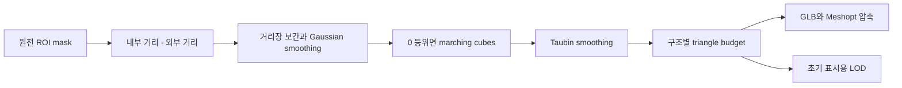
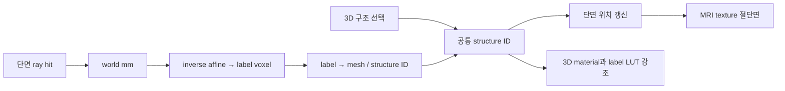

# Nervous System Atlas 기술 조사와 MRI-Tutor 비교

_2026-09-09 · 로컬 소스, 실제 MRI 파일 헤더, 데이터 명세, 공식 자료를 대조한 기술 조사_

## 🔎 결론과 검증 범위

**Nervous System Atlas의 가장 큰 강점은 MRI 원자료의 해상도보다, 서로 다른 해부학 자료를 공통 좌표와 구조 ID로 연결하는 데이터 엔지니어링 및 3D 표현에 있다.** MRI-Tutor는 이미 더 작은 복셀의 개인 MRI, 원래 영상 강도 보존, 개인 분할, 첫 응답 기록과 전이 연습을 갖고 있다. 따라서 Atlas 전체로 교체하기보다 이 기반에 개인별 3D 표면, MRI가 그려진 3D 절단면, 구조화된 임상 해부학 콘텐츠를 결합하는 것이 타당하다.

“몇 배 진보했다”는 단일 평가는 지지할 수 없다. README의 공개판 592 mesh와 MRI-Tutor의 실제 80 ROI mesh는 약 7.4배 차이지만, 전자는 전신 신경·혈관·척수까지 포함하고 후자는 뇌 학습용으로 범위를 제한했다. 개수 비율은 정확도나 학습 효과의 비율이 아니다. 더구나 이 Atlas 폴더에는 생성 데이터가 없어 592개를 실물로 검증하지 못했다.

조사 대상은 `/Volumes/Aquatope/_DEV_/Nervous System Atlas`와 `/Volumes/Aquatope/_DEV_/MRI-Tutor`의 **현재 로컬 파일**이다. Atlas는 `.git`, `node_modules`, `pipeline/raw`, `pipeline/work`, `public/data/manifest.json`이 없는 소스 배포본이다. 따라서 아래에서 다음을 구분한다.

| 증거 수준 | 이번에 확인한 내용 | 해석 범위 |
|---|---|---|
| 직접 측정 | MRI-Tutor 실제 NIfTI 헤더·해시, mesh JSON, Atlas 콘텐츠 JSON 개수·인용 참조 | 현재 로컬 파일에 대한 확인 |
| 코드 확인 | 다운로드·정합·meshing·shader·picking·학습 상태·QA 경로 | 구현된 처리 방식; 실행 성공을 의미하지 않음 |
| 저장된 기록 | Atlas 정합 JSON의 오차, README의 mesh 개수·용량, 배포 스크린샷 | 제작자의 산출물 기록; 이번 재측정 아님 |
| 외부 대조 | MNI, StudyForrest, FreeSurfer, BodyParts3D 공식 자료; Context7의 Three.js/NiiVue 문서 | 출처와 적용 원리 확인; 전체 데이터 재다운로드 아님 |

Atlas의 MRI/3D 런타임, 전체 빌드, 실측 FPS, 전문의 경계 검수 및 교육 효과는 이번에 검증하지 않았다. 배포 스크린샷은 시각 설계 참고로만 확인했다. MRI-Tutor의 기존 `npm test`는 **23/23 통과**했다. Atlas Python 소스 29개의 AST 구문 검사와 콘텐츠 최상위 인용 참조 검사는 통과했으며, 이는 전체 타입 검사·스키마 검사·의학적 검증과 다르다. 수치와 주요 파일 해시는 [조사 증거 JSON](/Volumes/Aquatope/_DEV_/MRI-Tutor/docs/research/2026-09-09-atlas-audit-evidence.json)에 저장했다.

도입 실행 범위와 완료 기준은 [MRI-Tutor 도입 계획서](/Volumes/Aquatope/_DEV_/MRI-Tutor/docs/ATLAS-INTEGRATION-PLAN.md)에 별도로 정리했다. 이번 작업은 조사와 계획이며 앱 구현은 변경하지 않았다.

## 🗂️ 폴더와 시스템 구성

| 위치 | 역할 | 기술적으로 중요한 점 |
|---|---|---|
| `pipeline/config/` | 출처·라이선스·다운로드 잠금·구조 선택·정합 설정 | `sources.yaml`, `sources.lock.yaml`, 두 표본의 affine 및 후처리 기록 |
| `pipeline/atlas_pipeline/` | Python 데이터 제작 | NIfTI 처리, atlas별 mask, mesh 생성, 표본 정합, 척수 재구성, manifest·QA |
| `blender/` | Z-Anatomy 추출 | headless `bpy`로 `.blend`의 MESH/CURVE와 랜드마크를 PLY로 내보냄 |
| `src/volume/` | MRI 표시와 좌표 변환 | 3D texture, GLSL 절단면, 정수 라벨·lookup texture |
| `src/loader/`, `src/picking/` | GLB 로딩·구조 선택 | Meshopt, LOD, 계통별 로딩, BVH raycast |
| `src/scene/`, `src/state/` | 장면·상호작용·상태 | clipping, 고품질 렌더링, 활동 중 품질 조정, 구조와 단면의 동기화 |
| `content/`, `tools/`, `scripts/content/` | 해부학·증후군·인용 제작 | JSON schema, 참조 검사, 용어와 본문의 분리, 영어/튀르키예어 지원 |
| `tests/`, `e2e/`, `scripts/check-*.ts` | 회귀와 패키지 검사 | 좌표·내용·공개판·GLB 검증; 검사 존재와 통과는 구별해야 함 |

브라우저는 Vite/TypeScript + Three.js + `three-mesh-bvh` 기반이다. Python은 nibabel, SciPy, scikit-image, trimesh, fast-simplification을 사용하고, 비선형 정합은 선택 의존성 `antspyx`에 있다. MRI-Tutor는 이미 Three.js r185와 NiiVue를 로컬에 포함한 정적 JS 앱이다. 엔진이 전혀 다른 세대인 것이 아니라 **데이터 및 장면 구성 방식이 다르다**.

직접 센 Atlas 콘텐츠는 구조 379개와 뇌신경 12개, 경로 25개, 증후군 125개, 퀴즈 60개, 용어 205개, 주제 19개로 총 **825개**다. 참고문헌 파일 657개, 최상위 인용 항목 2,387개이며 해당 참조의 누락은 없었다. 임상 내용 전체의 출처 적합성·정확성은 별도 검토 대상이다.

## 🧲 고해상도 MRI와 atlas는 어디서 오는가

### MRI 영상 자체

Atlas의 기본 배경은 TemplateFlow에서 내려받는 **MNI152NLin2009cAsym T1w/T2w res-01**이다. 코드에 그리드 `193 × 229 × 193`, 간격 `1 × 1 × 1 mm`, 원점 `(-96, -132, -78) mm`가 고정되어 있다. MNI 공식 설명도 2009c를 1 mm 템플릿으로 구분한다.[^mni]

`volumes.py`는 뇌 내부 강도 99.5 percentile을 상한으로 잡고 `0..255`에 선형 매핑해 **uint8 표시 파생본**을 만든다. x축이 가장 빨리 바뀌는 Fortran 순서로 직렬화하고 gzip 압축한다. 원본 NIfTI를 브라우저에서 직접 읽는 방식이 아니다. T1의 2 mm preview도 생성하지만, 현재 `src/main.ts`의 `loadContrast()`는 T1/T2 본체를 읽는다. **preview를 생성한다는 사실과 런타임에서 활용한다는 사실은 다르다.**

MRI-Tutor의 개인 T1 4개를 실제로 열어 헤더를 조사한 결과, 모두 `384 × 384 × 274`, 저장 간격 약 `0.667 × 0.667 × 0.700 mm`, `int16`이었다. StudyForrest의 공식 촬영 설명은 3T, 획득 복셀 0.7 mm를 명시한다. 더 작은 재구성 복셀은 실효 해상도와 같지 않다.[^studyforrest]

| 비교 항목 | Nervous System Atlas | 현재 MRI-Tutor |
|---|---|---|
| 주된 뇌 영상 | 1 mm 집단 평균 MNI 템플릿 | 약 0.7 mm 개인 3T T1/T2 4명 |
| 브라우저 영상 강도 | 미리 windowing한 uint8 | 개인 T1 int16, 정합 T2 float32 |
| 별도 참고 Atlas | 여러 원천을 MNI 장면에 배치 | CIT168 1 mm uint8, Allen 대응 0.5 mm uint8 템플릿 |
| MRI 화질 개선 핵심 | 공통 표시 체계, 부드러운 보간, 장면 연출 | 이미 있는 개인 영상을 활용할 3D·학습 연결 확장 |
| 직접 MRI에서 식별 가능한 경계 | atlas별로 다름 | 구조·시퀀스별로 다름 |

소결: Atlas가 모든 뇌 영상을 초고해상도 7T로 새로 확보한 프로젝트는 아니다. **7T 유래 atlas·분할과 기본 MRI 배경의 촬영 조건을 혼동하지 않아야 한다.**

### 세부 구조와 모델을 위한 자료 조합

아래 라이선스 열은 원칙적으로 **이 프로젝트가 기록한 분류**다. 이 표 자체가 MRI-Tutor 재배포 허가 검토를 대체하지 않는다. 실제 채택 시 다운로드한 버전·파일별 원천 조건을 확인한다.

| 자료 | Atlas에서 얻는 것 | 취득·가공 방식 | 기록된 조건 또는 제약 |
|---|---|---|---|
| MNI T1/T2, aseg | 기본 MRI·뇌 표면·큰 구조 | TemplateFlow NIfTI → intensity와 label 분리 | MNI/McGill |
| MASSP, MIAL | 심부핵·시상핵 | TemplateFlow의 MNI 배포 분할 | 저장소는 MNI로 분류; 파생 라벨 원천 조건 재확인 필요 |
| CIT168 | 피질하핵 | OSF의 deterministic/probabilistic atlas | CC BY 4.0 |
| Neudorfer hypothalamus | 시상하부 세부 구조 | Zenodo의 0.5 mm label atlas | CC BY 4.0 |
| CerebrA | 공개판 대뇌 피질 구획 | symmetric MNI 라벨 → 선택적 SyN → asymmetric MNI | CC0 기록; 원래 symmetric 공간을 명시 |
| FastSurfer CerebNet | 공개판 소뇌 소엽 | MNI T1에서 사전에 실행한 자동 분할 결과 | generated 자료; 추론 결과·체크포인트·명령을 별도 확보해야 함 |
| HCP1065 | 60개 백질 다발 | 배포된 NIfTI 다발 mask → 면 모델 | CC BY-SA 4.0; 개인 tractography 아님 |
| Mouches / VENAT | 동맥 분포·정맥 표면 | MRA 확률 / 7T QSM 유래 atlas의 threshold·영역 추출 | CC0 / CC BY 4.0 기록 |
| Liu arterial territories | 혈관 공급 영역 | NIfTI 라벨과 해더 보정 | CC BY-SA 4.0; 일부 공간 대응은 identity |
| BodyParts3D | MRI 분할로 얻기 어려운 혈관·해부 구조 | OBJ 및 FMA 계층에서 선택 → affine → mesh | 공식 archive의 현재 안내는 CC BY 4.0[^bp3d] |
| Z-Anatomy | 뇌신경·척수·말초신경·주변 구조 | Blender 모델 → PLY → 단위/축 변환 → affine·국소 보정 | CC BY-SA 4.0 기록; 표본/편집 모델[^zanatomy] |
| spine-generic / Fudan | 공개판 척수 MRI | 여러 사람 영상의 straightening·평균·합성 | CC BY 4.0 기록; 원래 해상도와 합성 구간 구분 |
| Brainstem Navigator / PAM50 | 비공개판 미세핵·척수 MRI | 별도 취득 또는 제한 자료 | 재배포 제한/라이선스 미확인으로 공개판 제외 |

공개판의 일부 뇌간 핵은 7T segmentation 자체가 아니라 **발표된 부피와 랜드마크에 맞춰 만든 타원체 위치 표지**다. `brainstem_landmarks.yaml`에 부피, 상대축, 기준점, 문헌이 명시돼 있다. 밝고 매끄러운 모양이 곧 MRI에서 보이는 정밀한 핵 경계는 아니다.

추가로 Z-Anatomy 공식 README는 전체 라이선스 안내와 별개로 내이 등 일부 포함 모델의 비상업 조건도 적고 있다.[^zanatomy] 이번에 선택된 신경 모델이 그 자료의 파생물인지까지 확인하지는 못했다. 따라서 Z-Anatomy라는 source 하나를 허용 목록에 넣는 것만으로 모든 객체의 배포 조건이 해결되었다고 간주하지 않는다.

## 🧩 양질의 3D 모델을 만드는 실제 과정

### Mask에서 GLB까지

`meshing.py`의 경로는 다음과 같다.

1. ROI 주변만 잘라 작업량을 줄이고 signed-distance field를 만든다.
2. 원래 복셀 부피로 계산한 간격이 0.75 mm 이상이면 기본 2배 보간한다. **MRI 자체의 해상도 향상이 아니라 표시 표면의 계단 완화**다.
3. Gaussian 처리 후 거리장 0 등위면을 추출한다. 보간 격자의 `(shape_in−1)/(shape_out−1)` 비율을 반영해 좌표 위치를 보존한다.
4. 작은 연결 성분을 제거하고 Taubin smoothing을 기본 20회 적용한다. 큰 mesh는 quadric decimation으로 줄인다.
5. 일부 동일 atlas의 인접 parcel은 0.35 mm 안의 서로 다른 mesh 정점을 평균 위치로 묶어 틈을 완화한다.
6. 구조별 GLB를 만들고 Meshopt로 압축한다. 12,000 triangle 이상 모델에는 보통 3,000 triangle LOD도 만든다.

대표 예산은 피질 parcel 20,000, medium 구조 8,000, 큰 뇌간·소뇌 구조 40,000, 뇌 envelope 60,000 triangle이다. 작은 핵에는 2,000/4,000 등의 별도 예산을 쓴다. 반면 MRI-Tutor의 현재 ROI 표면은 **같은 mask의 unsmoothed marching cubes**다. 실제 80 ROI 합계가 604,112 triangle이고, 단일 `atlas-meshes.json`은 envelope 등까지 포함해 **19,112,016 bytes**다. 이 로컬 수치는 파일에서 직접 계산했다.

매끈함을 위해 smoothing·decimation·welding을 적용하면 원래 mask와 표면 사이에 차이가 생긴다. 따라서 도입 시 **검증용 원래 mask / 표시용 smooth mesh / LOD**를 분리해야 한다. 작은 핵의 연결 성분 제거, 서로 접해 보이는 다른 atlas 간 welding, 신경 굵기 확대를 정답 경계 생성에 사용하면 안 된다.

### 이미 제작된 표본 모델의 활용

Z-Anatomy는 `.blend` 안의 객체를 해부학 명칭으로 선택한다. curve의 bevel과 end cap을 조절해 관 모양 신경을 만든다. 코드상 뇌신경 최소 반경 1 mm, 말초신경 1.5 mm 등의 **가시성 목적 확대**가 있다. 이 굵기를 실제 신경 직경으로 학습시키면 안 된다.

Blender world의 meter 단위와 축 방향을 MNI RAS millimeter로 바꾼 다음 12자유도 landmark affine을 적용한다. GLB 안에도 이 프로젝트는 mm 좌표를 유지하므로, 다른 GLB loader의 관례적인 meter 해석과 구별할 명시적 단위 계약이 필요하다.

## 📐 MRI와 3D를 통합하는 기술

### 하나의 world space, 서로 다른 voxel grid

NIfTI의 affine을 `A`라 하면 voxel `i`와 world point `p`는 `p=A·i`, `i=A⁻¹·p` 관계다. mesh 정점을 같은 world space에 배치하고, 그 world point에서 MRI를 샘플링하면 위치가 연결된다. **동일한 RAS 축을 사용한다는 것만으로 서로 다른 사람이나 서로 다른 MNI 템플릿이 정합되는 것은 아니다.**

Atlas는 이를 Three.js의 `Matrix4`와 `Data3DTexture`로 구현한다. MRI는 선형 보간 가능한 `R8`, label은 최근접 정수 조회 `R16UI/R8UI`로 분리한다. shader는 절단면 각 픽셀의 world 좌표를 voxel로 바꿔 `(voxel+0.5)/dims`에서 영상을 읽는다. 0.5는 texture의 복셀 중심을 맞추기 위한 항이다. 이런 3D texture 및 world clipping 기능은 Three.js 공식 API에 존재하며 Context7에서 확인했다.[^three]

3D 구조 선택은 저장된 centroid로 단면을 이동한다. MRI 클릭은 raycast 교차점을 world mm로 얻어 anatomical label을 읽고 대응 mesh를 선택한다. MRI에서 선택할 때는 단면을 다시 중심으로 이동시키지 않아 탐색 위치를 보존한다. 현재 `structureAt()`는 anatomical label과 척수 level 경로를 사용하므로 **모든 tract·혈관 tint를 클릭해 해당 구조를 고르는 범용 picking은 아니다**.

선택·증후군 관련·hover 상태는 작은 flag texture에 담는다. 전체 volume을 다시 만들지 않고 lookup texture와 shader uniform을 갱신한다. 단면 label의 주변 네 복셀과 선택 상태를 비교해 경계를 표시한다. `peel`은 같은 단면으로 mesh를 잘라 내부 구조를 드러낸다. MRI-Tutor의 3D에는 현재 사각 **LineLoop 참고 평면**만 있고 실제 MRI texture는 그려지지 않는다. 이것이 가장 직접적인 시각적 격차다.

### 정합 오차를 줄이는 후처리

저장된 `zanatomy_to_mni.json`은 31개 landmark의 평균 3.61 mm, 최대 7.4 mm를 기록한다. `bp3d_to_mni.json`은 평균 3.31 mm, 최대 8.53 mm이며 최대 오차 gate가 `false`다. 이는 해당 affine의 저장 지표로, 최종 후처리 mesh의 전 영역 정확도를 이번에 측정한 값은 아니다.

뇌 랜드마크에 맞춘 affine을 전신으로 연장하면 척수 중심선이 옆으로 흐르거나 뇌간이 전후로 어긋난다. 이 프로젝트는 그 문제를 실제로 다루고 있다.

- Z-Anatomy 중심선 drift를 측정해 두개강 아래에서 점진적으로 교정한다.
- 뇌간 전후 차이에 별도의 높이 기반 단조 cubic ramp를 적용하고, 위쪽 기준점에서는 변위를 0으로 고정한다.
- 뇌간의 서로 다른 segmentation 정의를 단순 silhouette로 비교하지 않고, 중뇌에서는 대응 핵·교련의 centroid를 사용한다.
- BodyParts3D 척추동맥에는 선택적 전후 보정을 적용한다. 다른 혈관에 같은 보정을 일괄 적용하지 않는다.
- affine을 다시 맞추면 기존 후처리를 stale로 표시해 QA에서 감지한다.

이는 재사용할 만한 **오차 진단 방법**이다. 반면 저장된 ramp의 수치를 MRI-Tutor의 개인 MRI에 복사하는 것은 타당하지 않다. 표본 모델, 기준 atlas, 구조 정의에 종속된 보정이기 때문이다.

### 척수 MRI의 연속 표시

공개판은 spine-generic 10명의 등방성 경수/상흉수 자료와 Fudan 14명의 전척추 자료를 straightened template으로 만든 뒤, Z-Anatomy 척수 중심선을 따라 다시 굽혀 표시한다. 코드에 기록된 원래 간격은 각각 0.8 mm 등방성, 약 `0.62 × 0.62 × 3.3 mm`다. 최종 0.75 mm 그리드는 재표본화 간격이며 원자료의 3.3 mm 방향 정보가 새로 생기는 것은 아니다.

추간판 위치에 따라 arc-length를 맞추고 겹치는 부분은 20 mm 범위에서 blend한다. rootlet 측정이 있는 level과 척추뼈 규칙으로 추정한 level을 구별한다. shader는 뇌 그리드 밖에서 척수 자체 affine을 사용해 다른 volume을 읽는다. **한 사람의 머리부터 천골까지 연속 촬영한 MRI가 아니라 교육용 합성 표준 장면**이다. MRI-Tutor의 뇌 학습 핵심을 완성한 뒤 별도 척수 팩으로 검토할 기능이다.

## ⚡ 성능과 임상 콘텐츠에서 배울 점

### 큰 장면을 빠르게 다루기

`MeshRegistry`는 계통별 최대 6개 동시 로딩, LOD 우선 표시, idle 때 최대 2개 full geometry 교체, 선택 구조의 우선 업그레이드를 구현한다. GLB의 정규화된 position 값을 float로 복원하고 node transform을 geometry에 반영한 다음 BVH를 만든다. 이전 geometry와 BVH는 교체 시 해제한다.

`Picker`는 드래그 중 hover raycast를 멈추고 프레임당 최대 한 번 처리한다. `SceneManager`는 변화가 있을 때 실제 렌더링하고, 이동 중 GTAO·SMAA 등 비싼 pass를 줄인다. peel 중에는 clipping과 맞지 않는 AO를 억제한다. 이런 전략은 600개에 가까운 구조를 무조건 매 프레임 검사·그리는 비용을 줄인다.

README의 전체 mesh 약 36 MB, 첫 표시 약 3.5 MB는 제작자 기록이다. 현재 생성 GLB가 없어 압축률·초기 표시 시간은 재측정하지 않았다. MRI-Tutor의 JSON 크기와 이 수치를 직접 비교해 몇 배 빨라진다고 예측할 수는 없다.

### 구조를 임상 추론에 연결하기

Atlas의 좋은 설계는 구조 ID를 다음 자료의 연결점으로 쓰는 것이다.

- 해부학 구조: 위치, 연결, 기능, 혈관 공급, imaging, 임상 관련성, pitfalls, 출처.
- 경로: 단계별 구조와 교차 위치.
- 증후군: 병변 위치, 관여 구조, 결손, 교차/좌우 논리, MRI 관련 설명.
- 퀴즈: 원래 작성한 vignette, 해설, 관련 구조·출처.

Zod 스키마와 reference 검사가 구성상의 누락을 줄이고, `verified` bibliography는 문헌 metadata를 확인했다는 의미다. **주장이 문헌으로 뒷받침되는지, 한국 진료 환경에 맞는지, 전문의가 검수했는지까지 인증하지 않는다.** 한국어 도입은 전체 문장 자동 번역보다 소수 핵심 모듈을 의사 검수와 함께 구성해야 한다.

## ⚠️ 그대로 이식하면 안 되는 경로

| 확인한 경로 | 구체적인 한계 | MRI-Tutor에 필요한 처리 |
|---|---|---|
| `CerebrA` warp가 선택 의존성 | antspyx가 없으면 symmetric label을 identity로 사용 | 일치하지 않는 space는 overlay 불가 또는 명시적인 별도 보기 |
| `nlin6-identity` alignment | NLin6 자료를 2009c에 identity로 놓는 경로 존재 | 실제 변환 또는 원래 공간 유지; affine resample을 registration으로 표현하지 않음 |
| 합성 label volume | `anat[mask]=gid`, `tract[mask]=gid`로 겹침을 후순위가 덮음 | 현재 MRI-Tutor의 개별 ROI mask 보존을 유지; 클릭 후보를 복수로 반환 |
| centroid 기반 단면 이동 | U자형·작은 구조의 중심이 mask 밖일 수 있음 | 현재의 실제 mask 내부 anchor와 단면별 내부 지점 전략 유지 |
| 고정 MNI 범위의 좌표 helper | `gridBoxMm`은 두 대각 꼭짓점만 변환; 축 정렬을 전제로 함 | 개인 oblique affine에는 8개 꼭짓점, 실제 plane basis, normal 사용 |
| uint8 MRI 파생본 | 사전 windowing에서 범위/정밀도 손실 | 원래 NIfTI 강도 보존; 8-bit는 명시적인 preview에만 사용 |
| smoothing·신경 반경 확대·타원체 | 시각적 명료성이 원래 경계와 다름 | 표현 종류와 정답 사용 가능 여부를 분리 |
| `loadContrast()` | 늦은 T1 요청이 이후 T2 선택을 덮을 수 있는 코드 경로 | MRI-Tutor 기존 request token을 모든 renderer에 확장; 런타임 재현 검사는 후속 필요 |
| clipping과 picking | `Picker` 자체에는 clipping plane 교차점 배제 처리가 보이지 않음 | 잘려서 안 보이는 면이 선택되지 않는지 재현·검증 후 구현 |
| 최대 정합 오차·QA 실행 | 저장 max gate 실패가 있어도 일반 QA는 평균 4 mm만 검사; `rebuild.sh` 끝은 `QA || true` | 학습 목적별 국소 gate 및 실패 시 배포 중단 |
| 재생성 누락 | Blender export, CerebNet 생성물, 선택 자료가 별도; 기본 build로 스크린샷 전체 복원 보장 안 됨 | 필요한 최소 자료부터 lock·제작법·산출물·검증을 완결 |

특히 첫 세 항목 때문에 README의 “정확히 일치”는 전체 자료에 적용할 수 없다. 통합된 장면의 설계 가치는 크지만, 다른 뇌를 같은 좌표에 배치하는 문제는 별도의 해부학적 검증을 요구한다.

## 🎯 MRI-Tutor에 가져올 우선순위

**최우선은 같은 사람의 MRI와 그 사람의 3D 모델을 연결하는 것이다.** StudyForrest는 개인별 FreeSurfer 피질 재구성 결과를 공개한다.[^fsdata] 현재 MRI-Tutor는 `rawavg.mgz`와 `aparc+aseg.mgz`를 받지만 pial/white surface를 가져오지는 않는다. 이미 있는 46개 개인 참고 label에서 ROI mesh를 만드는 경로는 새 자료 없이 시작할 수 있다.

| 순위 | 도입 사항 | 학습자가 얻는 변화 |
|---|---|---|
| 1 | 개인 label 기반 mesh + 좌표/표현 계약 | 오른쪽 MRI의 구조와 왼쪽 3D가 같은 사람을 가리킴 |
| 2 | 실제 MRI texture 절단면과 동기 clipping | 단면이 입체 구조의 어느 부분인지 직접 확인 |
| 3 | pial/white 및 피질 parcel + LOD/GLB | 실제 고랑·이랑과 깊은 구조의 관계 탐색 |
| 4 | 구조→단면→관계→교차/국소화 모듈 | 이름 찾기를 넘어 위치와 관계를 설명 |
| 5 | 검수된 tract·혈관·뇌간 표준 atlas 팩 | 개인 MRI에 없는 세부 지식을 근거와 함께 학습 |
| 후속 | 병변 사례·다중 시퀀스·척수 | 자료 및 검수 역량 확보 후 전공별 확장 |

NiiVue도 volume과 mesh의 동시 표시를 공식 지원한다.[^niivue] 따라서 전면 renderer 교체가 필수는 아니다. 기본 권고는 NiiVue의 MRI 처리와 Three.js의 해부학 장면을 유지하고, **검증된 좌표·단면 계약을 공유하는 adapter**를 추가하는 방식이다. 단일 NiiVue 장면은 짧은 비교 실험의 대안이며, 전체 MRI renderer 자체 개발은 현재 우선순위가 낮다.

## 🔗 재확인할 코드와 출처

아래 파일명/함수가 각 결론을 재검토할 시작점이다. 절대 경로는 이번 로컬 폴더 기준이다.

| 주제 | 근거 파일 |
|---|---|
| 출처와 빌드 전제 | [sources.yaml](</Volumes/Aquatope/_DEV_/Nervous System Atlas/pipeline/config/sources.yaml>), [pipeline 설명](</Volumes/Aquatope/_DEV_/Nervous System Atlas/docs/pipeline.md>) |
| MRI 해상도와 변환 | [spaces.py](</Volumes/Aquatope/_DEV_/Nervous System Atlas/pipeline/atlas_pipeline/spaces.py>), [volumes.py](</Volumes/Aquatope/_DEV_/Nervous System Atlas/pipeline/atlas_pipeline/volumes.py>) |
| 표면 품질 | [meshing.py](</Volumes/Aquatope/_DEV_/Nervous System Atlas/pipeline/atlas_pipeline/meshing.py>), [catalog.py](</Volumes/Aquatope/_DEV_/Nervous System Atlas/pipeline/atlas_pipeline/catalog.py>) |
| Blender와 표본 정합 | [export_zanatomy.py](</Volumes/Aquatope/_DEV_/Nervous System Atlas/blender/export_zanatomy.py>), [zanatomy.py](</Volumes/Aquatope/_DEV_/Nervous System Atlas/pipeline/atlas_pipeline/zanatomy.py>), [midline.py](</Volumes/Aquatope/_DEV_/Nervous System Atlas/pipeline/atlas_pipeline/midline.py>), [register.py](</Volumes/Aquatope/_DEV_/Nervous System Atlas/pipeline/atlas_pipeline/register.py>) |
| 저장된 정합 오차 | [Z-Anatomy 정합](</Volumes/Aquatope/_DEV_/Nervous System Atlas/pipeline/config/zanatomy_to_mni.json>), [BodyParts3D 정합](</Volumes/Aquatope/_DEV_/Nervous System Atlas/pipeline/config/bp3d_to_mni.json>) |
| 공간 불일치·겹침 | [atlas_meshes.py](</Volumes/Aquatope/_DEV_/Nervous System Atlas/pipeline/atlas_pipeline/atlas_meshes.py>), [labels.py](</Volumes/Aquatope/_DEV_/Nervous System Atlas/pipeline/atlas_pipeline/labels.py>) |
| MRI/3D 통합 | [coords.ts](</Volumes/Aquatope/_DEV_/Nervous System Atlas/src/volume/coords.ts>), [SlicePlane.ts](</Volumes/Aquatope/_DEV_/Nervous System Atlas/src/volume/SlicePlane.ts>), [slice.frag.glsl](</Volumes/Aquatope/_DEV_/Nervous System Atlas/src/volume/shaders/slice.frag.glsl>), [main.ts](</Volumes/Aquatope/_DEV_/Nervous System Atlas/src/main.ts>) |
| 성능 | [MeshRegistry.ts](</Volumes/Aquatope/_DEV_/Nervous System Atlas/src/loader/MeshRegistry.ts>), [Picker.ts](</Volumes/Aquatope/_DEV_/Nervous System Atlas/src/picking/Picker.ts>), [SceneManager.ts](</Volumes/Aquatope/_DEV_/Nervous System Atlas/src/scene/SceneManager.ts>) |
| 척수 합성 | [cord_public.py](</Volumes/Aquatope/_DEV_/Nervous System Atlas/pipeline/atlas_pipeline/cord_public.py>) |
| QA와 생성 경로 | [qa.py](</Volumes/Aquatope/_DEV_/Nervous System Atlas/pipeline/atlas_pipeline/qa.py>), [cli.py](</Volumes/Aquatope/_DEV_/Nervous System Atlas/pipeline/atlas_pipeline/cli.py>), [rebuild.sh](</Volumes/Aquatope/_DEV_/Nervous System Atlas/pipeline/rebuild.sh>) |
| 콘텐츠 | [content 설명](</Volumes/Aquatope/_DEV_/Nervous System Atlas/docs/content.md>), [content schema](</Volumes/Aquatope/_DEV_/Nervous System Atlas/src/types/content.ts>) |
| MRI-Tutor 기존 경로 | [개인 자료 제작](/Volumes/Aquatope/_DEV_/MRI-Tutor/scripts/build_individual_cases.py), [다운로드](/Volumes/Aquatope/_DEV_/MRI-Tutor/scripts/fetch_individual_cases.py), [개인 viewer](/Volumes/Aquatope/_DEV_/MRI-Tutor/trainer/case-viewer.js), [3D app](/Volumes/Aquatope/_DEV_/MRI-Tutor/trainer/app.js), [출처 설명](/Volumes/Aquatope/_DEV_/MRI-Tutor/trainer/DATA-SOURCES.md) |

[^mni]: MNI/McGill, [ICBM 152 nonlinear atlases version 2009](https://www.bic.mni.mcgill.ca/ServicesAtlases/ICBM152NLin2009). 2026-09-09 확인.
[^studyforrest]: StudyForrest, [Overview of data types — Brain structure and connectivity](https://studyforrest.org/data.html). 2026-09-09 확인. 촬영 간격과 파일 헤더 간격을 구분했다.
[^bp3d]: LSDB Archive, [BodyParts3D License](https://dbarchive.biosciencedbc.jp/en/bodyparts3d/lic.html). 페이지 갱신일 2025-02-27, 2026-09-09 확인.
[^zanatomy]: Z-Anatomy, [Models of human anatomy](https://github.com/Z-Anatomy/Models-of-human-anatomy). 모델 저장소와 로컬 `sources.yaml` 대조.
[^fsdata]: StudyForrest, [Reconstructed cortical surfaces](https://github.com/psychoinformatics-de/studyforrest-data-freesurfer). FreeSurfer 5.3, T2를 포함한 재구성과 surface QA 설명을 2026-09-09 확인.
[^three]: Three.js 공식 저장소, [Data3DTexture](https://github.com/mrdoob/three.js/blob/dev/docs/pages/Data3DTexture.html), [Material clipping planes](https://github.com/mrdoob/three.js/blob/dev/docs/pages/Material.html). Context7 `/mrdoob/three.js`로 2026-09-09 조회. 도입 시에는 MRI-Tutor에 포함된 버전과 API를 다시 대조한다.
[^niivue]: NiiVue 공식 저장소, [development guide](https://github.com/niivue/niivue/blob/main/packages/niivue/DEVELOP.md), [loading documentation](https://github.com/niivue/niivue/blob/main/packages/docs/docs/loading.mdx). Context7 `/niivue/niivue`로 2026-09-09 조회. 현재 앱의 내부 상태 접근을 포함한 호환성은 별도 실험 대상으로 남긴다.
